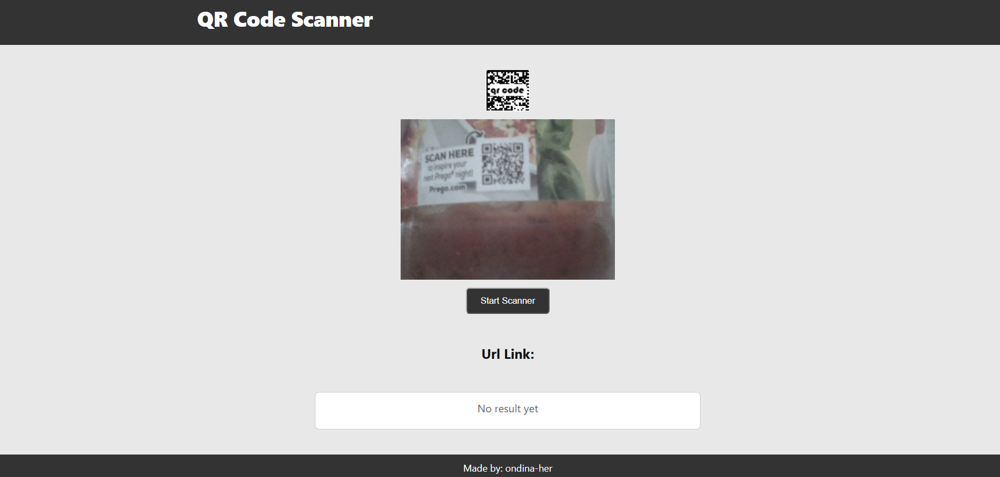
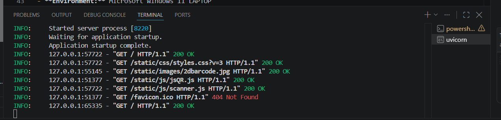
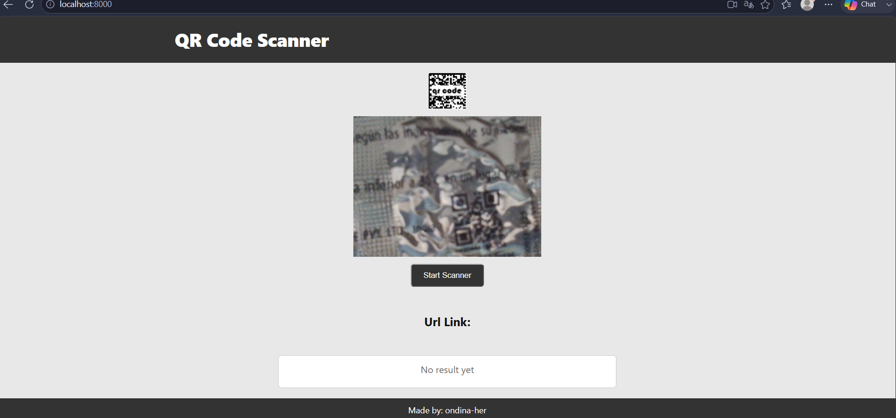
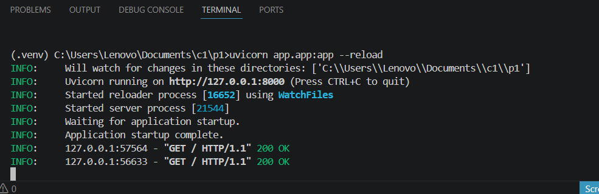
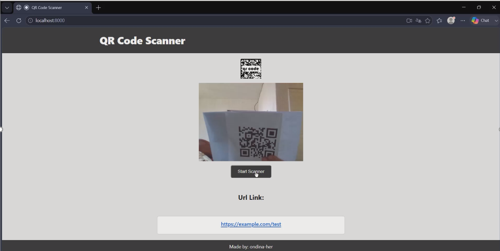
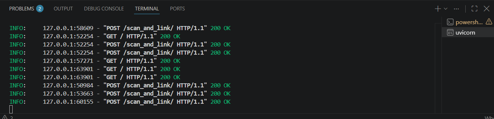

# Bug Report

# QR scanner fails to decode QR code smaller than 5CM
## 1. Bug Summary three times 
- **Title:** Scanner app fail to decode small size QR code 
- **Date:** 5 August 2026
- **Reporter:** Ondina Hernandez
- **Environment:** Microsoft Windows 11 LAPTOP

## 2. Severity and Priority
- **Severity:** High
- **Priority:** High

## 3. Description
- QR scanner fails to decode a QR code that are less than 5 cm. 

## 4. Steps to Reproduce
1. Open the application.
2. Click button Start scanner 
3. Allow camera permissions.
4. Align camera with any printers QR code less than 5 cm.

## 5. Expected Result
- The application should successfully parse the payload and display the url or text or other on placeholder.

## 6. Actual Result
- The frame doesn't capture the code and display nothing. 

## 7. Evidence
- 
- 
## 8. Impact
- Users cannot visually confirm that a QR code has been detected.

## 9. Status
- **Open**

# QR scanner fails to decode blurry QR codes 
## 1. Bug Summary
- **Title:** Scanner app fail to decode blurry QR code 
- **Date:** 5 August 2026
- **Reporter:** Ondina Hernandez
- **Environment:** Microsoft Windows 11 LAPTOP

## 2. Severity and Priority
- **Severity:** High
- **Priority:** High

## 3. Description
- QR scanner fails to decode a QR code that seem blurry at first sight. 

## 4. Steps to Reproduce
1. Open the application.
2. Click button Start scanner 
3. Allow camera permissions.
4. Align camera with any printed QR code that seem blurry at first sight.

## 5. Expected Result
- The application should successfully parse the payload and display the url or text or other on placeholder.

## 6. Actual Result
- The frame doesn't capture the code and display nothing. 

## 7. Evidence
- 
- 
## 8. Impact
- User cannot visually confirm that a QR code has been detected.

## 9. Status
- **Open**

# QR detection bounding box is not displayed on the camera overlay
## 1. Bug Summary
- **Title:** Scanner app fail to show bounding box on camera overlay
- **Date:** 8 August 2026
- **Reporter:** Ondina Hernandez
- **Environment:** Microsoft Windows 11 LAPTOP

## 2. Severity and Priority
- **Severity:** Minor
- **Priority:** Medium

## 3. Description
-  Missing QR code detection bounding box on camera overlay.

## 4. Steps to Reproduce
1. Open the application.
2. Click button Start scanner 
3. Allow camera permissions.
4. Align camera with any printers QR code.

## 5. Expected Result
- The green or white box froze around that QR code in real time when found.

## 6. Actual Result
- The stream shows no visual marker when a QR code is in view.

## 7. Evidence
- 
- 

## 8. Impact
- Users can't visually confirm that a bounding box On the camera overlay.

## 9. Status
- **Open**
